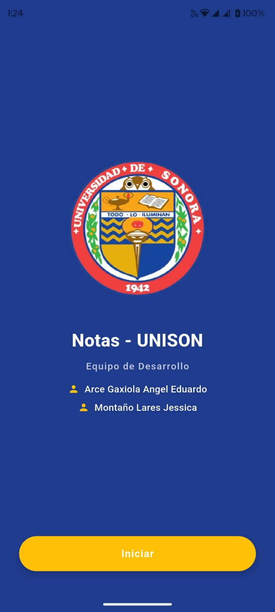
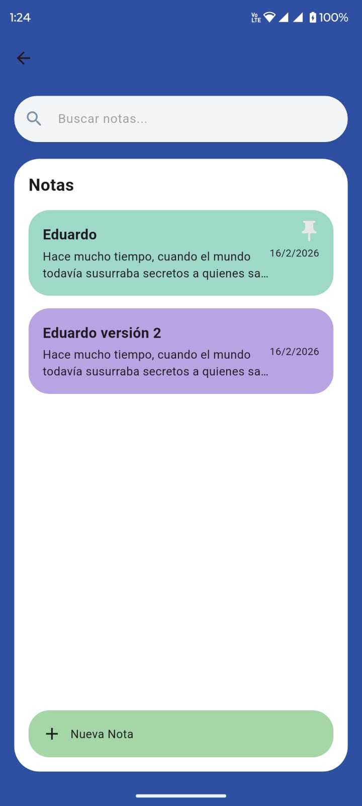
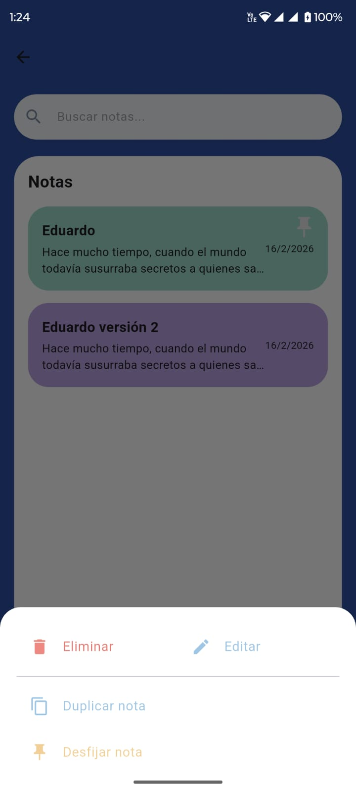
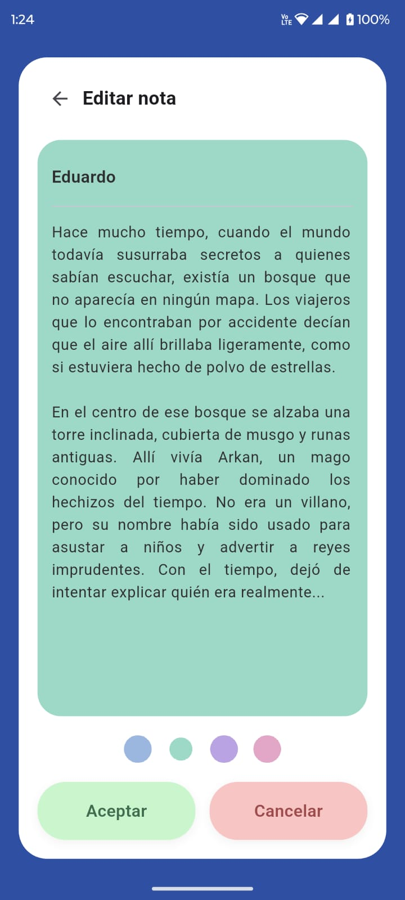
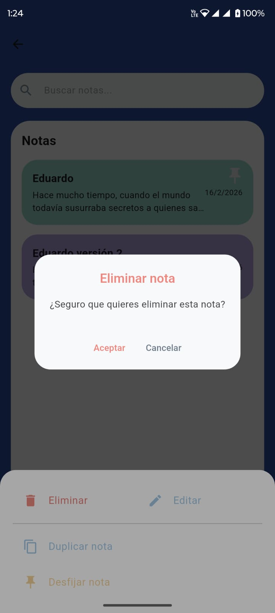
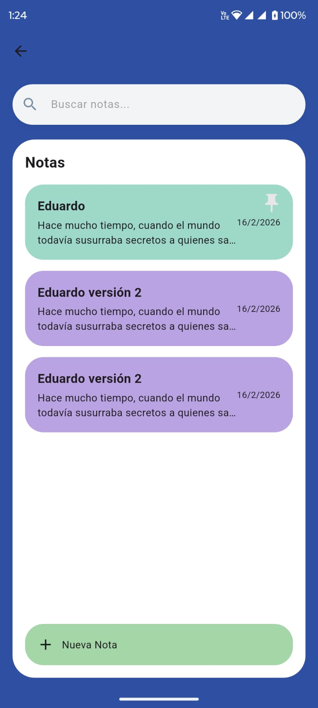

# app_pds

Aplicación desarrollada en Flutter que permite crear, editar, eliminar y fijar notas.
Desarrollada para la materia de Practicas de Desarrollo de Sistemas III (Programacion Movil)

Caracteristicas:

Crear notas
- Editar notas
- Fijar notas (Pin)
- Guardado local con SQLite

Tecnologias:

- Flutter Flutter 3.41.0 • channel stable • https://github.com/flutter/flutter.git
- Tools • Dart 3.11.0 • DevTools 2.54.1
- Sqflite 2.4.2
- Sqflite android 2.4.4.2 + 2
- Sqflite common 2.5.6
- 

  
Nuestra presentacion:
https://www.canva.com/design/DAHBbg3mw1s/dB_KDPaML5g-WllFs94pxg/edit?utm_content=DAHBbg3mw1s&utm_campaign=designshare&utm_medium=link2&utm_source=

Imagenes:

  
  
  
  

  
  
  

